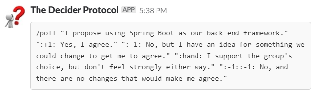
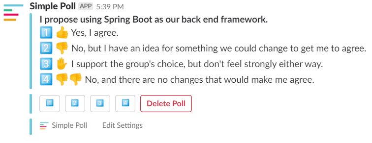

# The Decider Protocol for Slack
A slack integration that lets you quickly create polls based on [The Decider Protocol.](https://liveingreatness.com/core-protocols/decider/)

# Getting Started
## How it works
Write a proposal for your group.

The Decider Protocol will generate the text for a poll.

Which can be be copy and pasted to create a poll for the group.

## Installation
### Add Simple Poll to Slack
Using this integration depends on **Simple Poll** to generate the poll. [Add Simple Poll to Slack Here.](https://simplepoll.rocks/)

## Add The Decider Protocol to Slack

# Source Code
Based on [Easy-Peasy Slash Commands: Getting Started by D.E. Goodman-Wilson](https://medium.com/slack-developer-blog/easy-peasy-slash-commands-getting-started-c37ff3f14d3e)